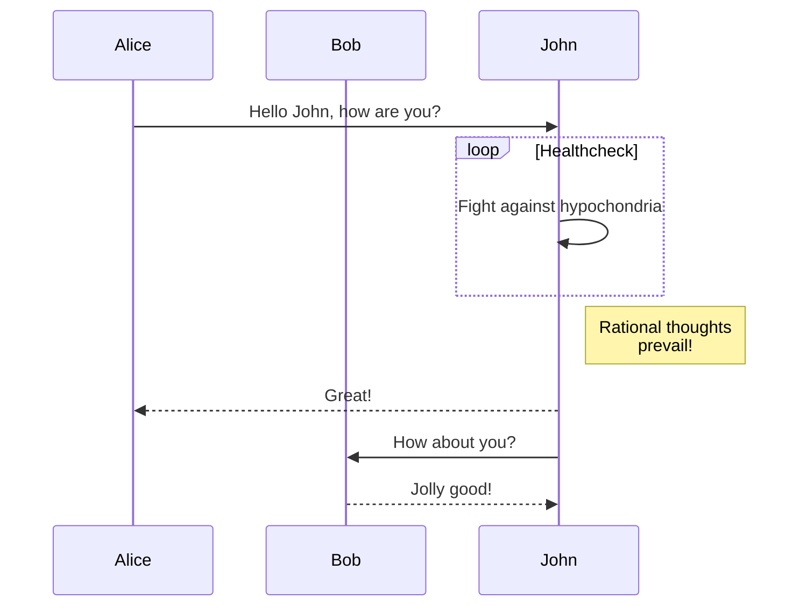
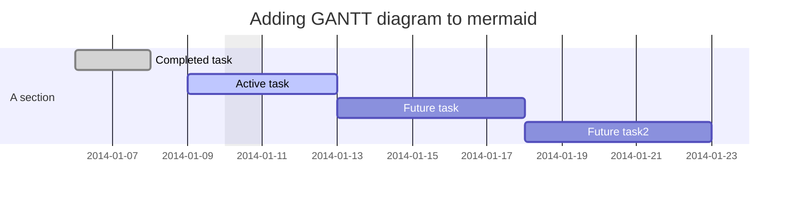
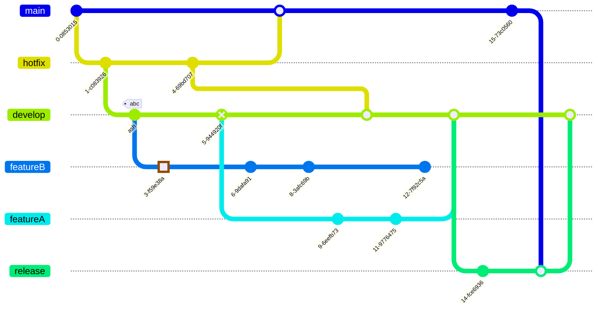
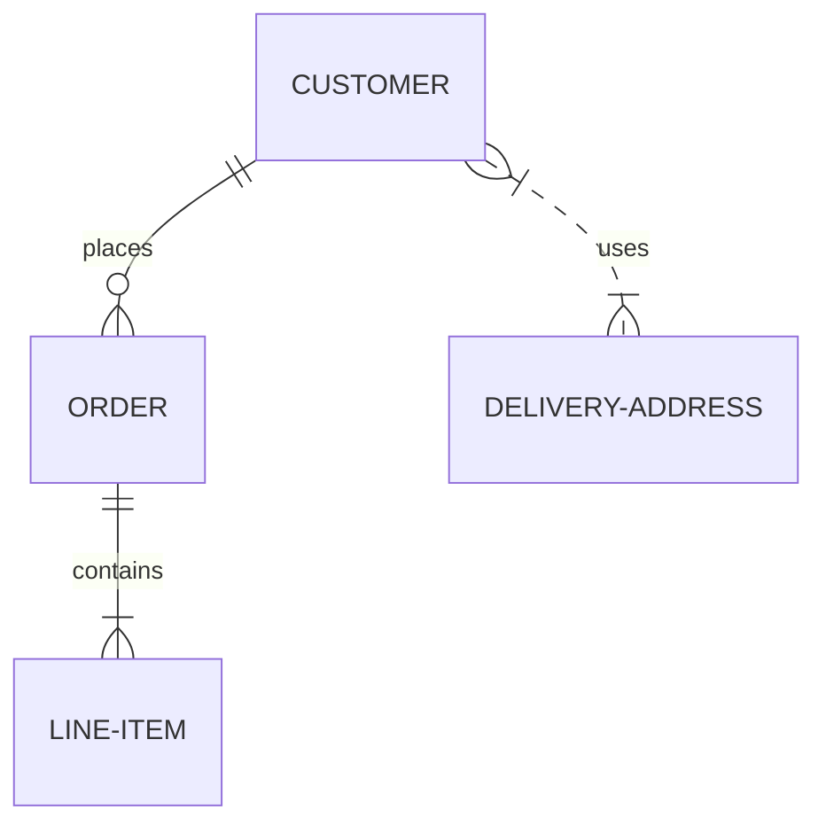
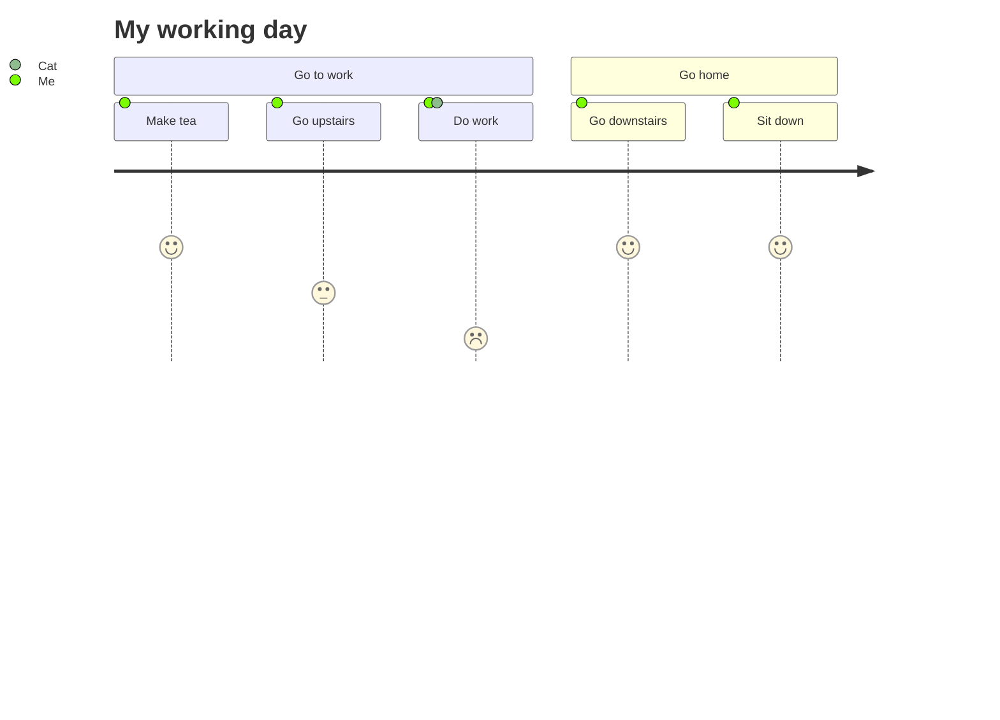

## 1 引用块


Blockquotes for note.



Blockquotes for tip.



Blockquotes for warning.



Blockquotes for warning.


## 2 公式
$$ c = \pm\sqrt{a^2 + b^2} $$

$$ f(x)=\int_{-\infty}^{\infty} \hat{f}(\xi) e^{2 \pi i \xi x} d \xi $$

## 3 字符注音或者注释
[Hugo]^(一个开源的静态网站生成工具)

## 4 分数
[浅色]/[深色]

[99]/[100]

## 5 emoji
[Emoji 支持](https://hugodoit.pages.dev/zh-cn/emoji-support/)

去露营啦! :tent: 很快就回来.

真开心! :joy:

## 6 GoAT
```goat
ASCII input here
```

```goat
          .               .                .               .--- 1          .-- 1     / 1
         / \              |                |           .---+            .-+         +
        /   \         .---+---.         .--+--.        |   '--- 2      |   '-- 2   / \ 2
       +     +        |       |        |       |    ---+            ---+          +
      / \   / \     .-+-.   .-+-.     .+.     .+.      |   .--- 3      |   .-- 3   \ / 3
     /   \ /   \    |   |   |   |    |   |   |   |     '---+            '-+         +
     1   2 3   4    1   2   3   4    1   2   3   4         '--- 4          '-- 4     \ 4
```

```goat
           .-.           .-.           .-.           .-.           .-.           .-.
          |   |         |   |         |   |         |   |         |   |         |   |
       .---------.   .--+---+--.   .--+---+--.   .--|   |--.   .--+   +--.   .------|--.
      |           | |           | |   |   |   | |   |   |   | |           | |   |   |   |
       '---------'   '--+---+--'   '--+---+--'   '--|   |--'   '--+   +--'   '--|------'
          |   |         |   |         |   |         |   |         |   |         |   |
           '-'           '-'           '-'           '-'           '-'           '-'
```

```goat
                ________                            o        *          *   .--------------.
   *---+--.    |        |     o   o      |         ^          \        /   |  .----------.  |
       |   |    '--*   -+-    |   |      v        /            \      /    | |  <------.  | |
       |    '----->       .---(---'  --->*<---   /      .+->*<--o----'     | |          | | |
   <--'  ^  ^             |   |                 |      | |  ^    \         |  '--------'  | |
          \/        *-----'   o     |<----->|   '-----'  |__|     v         '------------'  |
          /\                                                               *---------------'
```

```goat
   o--o    *--o     /  /   *  o  o o o o   * * * *   o o o o   * * * *      o o o o   * * * *
   o--*    *--*    v  v   ^  ^   | | | |   | | | |    \ \ \ \   \ \ \ \    / / / /   / / / /
   o-->    *-->   *  o   /  /    o * v '   o * v '     o * v \   o * v \  o * v /   o * v /
   o---    *---
                                 ^ ^ ^ ^   . . . .   ^ ^ ^ ^   \ \ \ \      ^ ^ ^ ^   / / / /
   |  |   *  o  \  \   *  o      | | | |   | | | |    \ \ \ \   \ \ \ \    / / / /   / / / /
   v  v   ^  ^   v  v   ^  ^     o * v '   o * v '     o * v \   o * v \  o * v /   o * v /
   *  o   |  |    *  o   \  \

   <--o   <--*   <-->   <---      ---o   ---*   --->   ----      *<--   o<--   -->o   -->*
```

## 7 流程图










